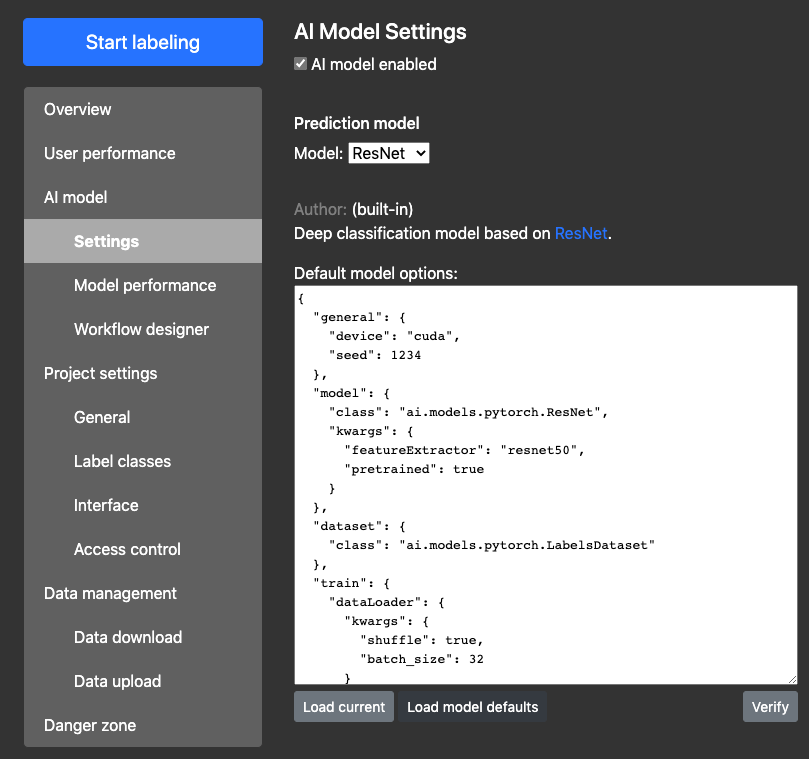
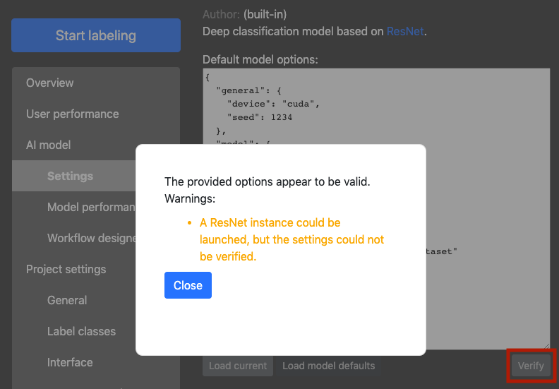

# Custom AI Backend

AIDE supports the implementation of arbitrary prediction models, using any framework as long as they are implemented in, or provide the appropriate interface to, Python.
In detail, the following portions are customizable:
* The prediction model itself
* The ranking model (_i.e._, the model providing priority scores for predictions)
* The annotation filtering model (TBA)

Note that some models are already built-in and can be configured, so that you might not need to write a custom model at all. Check out the associated [manual page](builtin_models.md) for details.


The following sections will provide details on how to implement custom models for each portion.


## Implement a custom prediction model

As a bare minimum, a custom prediction model must support routines for training, inference (prediction), and model state averaging (for combining model parameters when training was distributed across multiple AIWorkers).

Below is a sample code shell for a minimal custom prediction model:

```python

    class MyCustomModel:
        def __init__(self, project, config, dbConnector, fileServer, options):
            """
                Model constructor. This is called by both the AIWorker and AIController
                modules when starting up.
                Args:
                    project: String, name of the project the model is run in
                    config: Configuration for the general AIDE setup
                    dbConnector: Access to the project database
                    fileServer: Access to the instance storing the images
                    options: A custom set of options in JSON format for this model
            """
            self.config = config
            self.dbConnector = dbConnector
            self.fileServer = fileServer
            self.options = options


        def train(self, stateDict, data, updateStateFun):
            """
                Training function. This function gets called by each individual AIWorkers
                when the model is supposed to be trained for another round.
                Args:
                    stateDict: a bytes object containing the model's current state
                    data: a dict object containing the image metadata to be trained on
                    updateStateFun: function handle for updating the progress to the
                                    AIController
                
                Returns:
                    stateDict: a bytes object containing the model's state after training
            """

            raise NotImplementedError('to be implemented')
        

        def average_model_states(self, stateDicts, updateStateFun):
            """
                Averaging function. If AIDE is configured to distribute training to multiple
                AIWorkers, and if multiple AIWorkers are attached, this function will be called
                by exactly one AIWorker after the "train" function has finished.
                Args:
                    stateDicts: a list of N bytes objects containing model states as trained by
                                the N AIWorkers attached
                    updateStateFun: function handle for updating the progress to the
                                    AIController

                Returns:
                    stateDict: a bytes object containing the combined model states
            """

            raise NotImplementedError('to be implemented')


        def inference(self, stateDict, data, updateStateFun):
            """
                Inference function. This gets called everytime the model is supposed to be run on
                a set of images. The inference job might be distributed to multiple AIWorkers, but
                there is no need to worry about concurrency or race conditions, as each inference
                job is handled separately.
                Args:
                    stateDict: a bytes object containing the latest model state
                    data: a dict object containing the metadata of the images the model needs to
                          predict
                    updateStateFun: function handle for updating the progress to the
                                    AIController
            """

            raise NotImplementedError('to be implemented')
```

Note the following:
* The layout given in the sample code above must not be changed (_i.e._, it must
  exactly contain the functions and their arguments specified).
* You may add more custom functions, packages, files, etc. the model can rely on,
  though.


### Data and argument specifications

#### Constructor parameters
* **config:** Provides the model with configuration parameters as specified in the [configuration *.ini file](configure_settings.md). To access a parameter, use the following syntax (example):
```python
    param = config.getProperty('AIController', 'result_backend', type=str, fallback=None)
```
This example would return the `result_backend` entry under section `AIController`, or `None` if not present. Arguments `type` (default: `type=str`) and `fallback` are optional. If parameter not present and `fallback` not specified, the function raises an exception.

* **dbConnector:** Provides access to the project database. Note: this is only needed under exceptional circumstances. **There is no need to manually store annotations or model states; this is taken care of by the _AIWorker_ directly.**
If you do need to access the database, you can do so as follows (example):
```python
    sql = 'SELECT * FROM {project}.annotation WHERE x > %s;'.format(project=self.project)
    arguments = 0.5
    numReturn = 'all'
    result = self.dbConnector.execute(sql, (arguments,), numReturn)
```
This would return a list of dicts with values from the `annotation` table.

* **fileServer:** This is the most typically used helper, as it returns images needed for training and inference.
Example:
```python
    import io
    from PIL import Image
    filename = 'relative/local/path/IMG_0001.JPG'
    imgBytes = BytesIO(fileServer.getFile(filename))
    image = Image.open(imgBytes)
```
This code requests an image with given path from the _FileServer_ instance and opens it as a [PIL Image](https://pillow.readthedocs.io/en/stable/). You may also use other libraries and formats than PIL, such as [TensorFlow records](https://www.tensorflow.org/tutorials/load_data/images). Note that results are returned as bytes and need to be read and converted.
**Notes:**
    * You can only access files from within your own project (_i.e._, `<file server root>/<projectName>/<your path here>`).
    * Parent accessors (`..`) and absolute paths (`/path/etc/`) are forbidden and will return `None`.
    * If an image cannot be found, or any other error occurs, `None` is returned.

* **options:** These are parameters specific to the model. Use this for _e.g._ setting the model's learning rate, batch size, etc. Options can be provided through a JSON file; this requires setting the 'model_options_path' to the file path of the file in the [configuration *.ini file](configure_settings.md).


#### Training parameters
* **stateDict:** This parameter contains a bytes object of the latest model state. Note that the actual contents of the `stateDict` are not restricted explicitly and may be set arbitrarily by the model you design. The only absolute restrictions are:
- The data for the `stateDict` need to be serializable;
- You need to provide an actual bytes array.
So, for example, you can save your model state into a Python dict and use the pickle module to serialize it.
Loading such an object could then look as follows:
```python
    import pickle
    import io
    stateDict = pickle.load(io.BytesIO(stateDict))
```

* **data:** This contains the metadata for all the images the model needs to be trained on. Data come as a Python dict according to the following specifications (bounding box example shown):
    ```python
        data = {
            'images': {
                '83d7b609-e3d1-45fb-8701-79f50d25087c': {
                    'filename': 'A/_set_1/IMG_0023.jpeg',
                    'annotations': [
                        {
                            'id': 'd8f396fa-d5c4-41e0-befc-1eff23210315',
                            'x': 0.4434,
                            'y': 0.3121,
                            'width': 0.754,
                            'height': 0.424,
                            'label': '745edd1d-80bc-4060-980a-962ab85e0268',
                            'unsure': True
                        },
                        {
                            'id': '66f3f594-01da-4a9c-820c-e69453145e71',
                            'x': 0.0134,
                            'y': 0.9943,
                            'width': 0.2343,
                            'height': 0.3,
                            'label': '5af0a711-db9d-42f4-8316-a2f729a3d8d0',
                            'unsure': False
                        },
                        # etc.
                    ]
                },

                'bc16e215-3c4e-4607-990b-b2415dd51bca': {
                    'filename': 'A/_set_2/DSC_0321.JPG',
                    'annotations': []
                },

                # etc.
            },

            'labelClasses': [
                '745edd1d-80bc-4060-980a-962ab85e0268': {
                    'name': 'Elephant',
                    'color': '#929292'
                },
                '5af0a711-db9d-42f4-8316-a2f729a3d8d0': {
                    'name': 'Giraffe',
                    'color': None
                }
            ]
        }
    ```

    Notes:
    * All images to train on are placed with their stringified UUID as a key under section 'images'.
    * Likewise, annotations belonging to an image are collated in a list under the very image's 'annotations' section.
    * Label classes are placed in a dedicated section with their identifier as key.
    * Annotations link to the label classes through the 'label' entry.
    * Any value is optional. For example, annotations may not have coordinates (if image labels), images may not have any annotations, etc. As such, you have to expect certain values to be `None`, or not be present at all.
    * For coordinates (points, bounding boxes, etc.):
        * All values are relative w.r.t. the image bounds. For example, `x = 0.5` denotes that the x coordinate of this very annotation is exactly in the middle of the image; `width = 0.23` means that the width of the annotation is 23% of the image's width, etc.
        * For bounding boxes, x and y denote the rectangle _center_.
    * For segmentation masks:
        * Instead of coordinates, each entry under `annotations` contains three values:
            * `segmentationmask`: a base64-encoded string containing the segmentation mask;
            * `width`: the width of the segmentation mask;
            * `height`: the height of the segmentation mask.
          To create a PIL Image from the encoded segmentation mask, you can use the following code snippet:
          ```python
            from util.helpers import base64ToImage
            image = base64ToImage(segmentationMask, width, height)
          ```
        * All class indices (ordinals) specified by the user start at 1 (one). Unless you have a dedicated "background" class (see next point), you may want to shift your annotation segmentation mask values down by one, also depending on the model.
        * In the latest versions of AIDE it is possible to specify whether unlabeled pixels in a segmentation map should be treated as "background" or completely ignored. This is a shortcut for projects that only require segmenting objects, instead of the full image.
        Make sure to adhere to this property in your custom model. You can find out the setting through the parameter `ignore_unlabeled` of the `AIModel` base class:
        ```python
            self.ignore_unlabeled
        ```
        If `ignore_unlabeled` is `True`, the loss function of your custom model should only consider pixels in the annotation segmentation mask whose value is greater than zero.
        If `ignore_unlabeled` is `False` instead, all annotation segmentation mask pixels with ground truth value zero should be treated as "background." To this end, a dedicated background class with index 0 (zero) is automatically added to the project.


#### Inference parameters
* **stateDict:** See above (section "Training parameters").
* **data:** Similarly to the training data, also the inference data come in Python dict format. As a matter of fact they look exactly the same as in the training case, except that all 'annotations' sections are completely missing.
* **(return value)** In the inference case, the model needs to return a Python dict containing model predictions.
These may look as follows (bounding box example shown):
```python
    return {
        '83d7b609-e3d1-45fb-8701-79f50d25087c': {
            'predictions': [
                'x': 0.3112,
                'y': 0.3322,
                'width': 0.533323454,
                'height': 0.4135,
                'label': '5af0a711-db9d-42f4-8316-a2f729a3d8d0',
                'confidence': 0.958,
                'logits': [
                    0.042,
                    0.958
                ]
            ]
        },

        'bc16e215-3c4e-4607-990b-b2415dd51bca': {
            'predictions': []
        },

        # etc.
    }
```

  Notes:
  * You need to return one entry per image, with the stringified image UUID as a dict key (you receive the image UUID and its filename through the `data` variable).
  * Every image returned must have a 'predictions' section, holding a list of predictions
  * Only the following data types are allowed for variables holding primitives: `int`, `float`, `str`. Do not provide Numpy arrays (or values), Torch tensors, etc. Always be sure to call the appropriate methods to extract raw values, such as `.toList()`, `.item()`, etc. Failing to do so will result in the _AIWorker_ trying to commit to the database, but not doing so silently (it will just put an error message to the command line console).
  * Each item in the predictions list may contain the following variables:
    * `label`: a stringified UUID of the predicted label class (image labels, points, bounding boxes) or a (WxH) list or NumPy ndarray of long values denoting the label class index for each pixel (for segmentation masks)
    * `confidence`: a float denoting the model confidence value of the prediction (image labels, points, bounding boxes) or a (WxH) list or NumPy ndarray of float values denoting the confidence for each pixel (usually the max across all label classes).
    * `logits`: a list of floats of class logits (image labels, points, bounding boxes) or a (CxWxH) list or NumPy ndarray of float values denoting the confidence for each pixel and label class indices in C. This is _e.g._ used by the `Breaking Ties` Active Learning criterion.
    * Any variable required through the 'predictionType' setting per prediction type. For example, if the prediction type for a project is set to 'boundingBoxes', you also have to provide `x`, `y`, `width` and `height` values.
  * For segmentation masks:
    * Make sure to always predict a segmentation mask that has the same spatial dimensions as the input image.
    * Return either a list of lists or a NumPy ndarray for `label`, `confidence` and `logits`, _not_ a base64-encoded string.


### Registering your model

In order to make your model visible through AIDE, it needs to be registered.
To do so, add an entry to the [ai/__init__.py](https://github.com/microsoft/aerial_wildlife_detection/blob/master/ai/__init__.py) file:
```python

PREDICTION_MODELS = {

    # built-ins
    # ...

    # your custom model
    'ai.models.contrib.MyGreatModel': {
        'name': 'My great model',
        'author': 'Awesome contributor',
        'description': 'Description of my great model. See <a href="https://bkellenb.github.io" target="_blank">here</a>.',
        'annotationType': ['points', 'boundingBoxes'],
        'predictionType': 'points',
        'canAddLabelclasses': False,
        'canRemoveLabelclasses': False
    }
}
```

Notes:
* Key: your custom model's key (`ai.models.contrib.MyGreatModel` in the example) is the unique identifier of your model's architecture and should reflect the Python import path under which your model's main class (as described above) can be accessed. In the example, your model's main file has to reside under `aerial_wildlife_detection/ai/models/contrib/MyGreatModel`. You can also add a file `aerial_wildlife_detection/ai/models/contrib/__init__.py` and specify the import in there (`from xx.yy import MyGreatModel`).
* `description`: you can put HTML elements in here, such as links (as shown), images, and more. Be aware that AIDE itself does not serve static content like images from the model directory; this has to come from another server. Also, `<script>` tags will be removed.
* `annotationType`: specify here what kind of annotations your model supports. This can either be a single string, or a list of strings if the model can cope with different types of inputs. Has to be one of {'labels', 'points', 'boundingBoxes', 'segmentationMasks'}.
* `predictionType`: likewise, this is the kind of output the model generates and must be a string.
* `canAddLabelclasses` and `canRemoveLabelclasses`: flags whether the custom model implementation supports the addition of new, resp. removal of obsolete label classes. If at least the first parameter is set to `True`, training states of the model will be shareable with others through the Model Marketplace. However, just setting this value to `True` does not mean that it automatically supports sharing! You still have to implement it (see below).


### Extra features

In addition to the bare minimum explained above, a prediction model can provide the following enhancements, if implemented:
1. Support for adding new and removing obsolete label classes. This is a requirement for the model to be shareable on the Model Marketplace (to be announced soon).
2. Verify integrity of provided configuration options.
2. Support for pretty-printed configuration options through the GUI.

For best user experience, it is strongly recommended to implement all three aspects into your custom model.


#### 1. Adding new and removing obsolete label classes

If a custom model (state) is to be shared with other projects, the chances are virtually 100% that the new projects' label class definitions are different from the one the model has been trained on. Even if the label class names are identical, __their IDs are not__. Hence, a shareable custom model must provide routines to incorporate new label classes.

Basically, this requires doing the following:
1. At the start of the training routine (`train`), go through the label classes and compare the entries with what your model is trained on:
```python
# get all label class IDs from the project and the model
classes_project = set(data['labelClasses'].keys())
classes_model = set(...)     # extract from variable "stateDict"

# find new and obsolete classes
classes_new = classes_project.difference(classes_model)
classes_obsolete = classes_model.difference(classes_project)
```
2. Modify your model to reflect changes. For deep learning models, doing so requires at least adding new output neurons for new classes and removing outputs for obsolete ones. Doing this the most efficient way is an entire research area in its own. A viable approach is the following (pseudocode):
```python
for label in classes_new:
    # perform inference on images with new class:
    pred, weights = model(images[label])    # keep class activations and weights of final layer
    newWeight = mean(pred * weights)      # calc. an average of per-class output weights times their activations across all images with new class
    model.weights += newWeight          # append new weight to model's last layer's weights
```
3. Don't forget to update your model's label class definitions to reflect that new classes have been added (and old ones deleted).


Finally, make sure to enable sharing of model states across projects through the Model Marketplace by setting `canAddLabelclasses` and (if implemented) `canRemoveLabelclasses` to `True` (see above). Only if done so, your custom model will be visible on the Model Marketplace.


#### 2. Advanced model options

AIDE allows users to set and modify model parameters through the web interface:


In this process, there is a high risk of them introducing errors into the configuration. These may include value errors (e.g., negative learning rates) as well as formatting errors.

To this end, AIDE includes two mechanisms:
1. A function to load default values, as defined by the model author;
2. Functionality to verify user-provided model options for integrity.

Both functions can be accessed via dedicated buttons (see bottom of the screenshot). For a custom model, this means that the following two additional functions must be implemented:

```python

    class MyCustomModel:

        # __init__, train, inference, etc., go here as explained above


    @staticmethod
    def getDefaultOptions():
        """
            Returns a string of options that contains default values and
            is syntactically correct.
            Tip: you can define them e.g. in your model's __init__.py file,
            a dedicated .py file, or e.g. a .json file in your model folder.
        """
        defaultOptions = ...    # load accordingly
        return defaultOptions

    
    @staticmethod
    def verifyOptions(options):
        """
            Placeholder to verify whether a given dict of options are valid
            or not. To be overridden by subclasses.
            Args:
                options: a dict object containing parameters for a model.
            
            Returns:
                - None if the subclass does not support the method (for compa-
                  tibility reasons with legacy implementations)
                - True/False if the given options are valid/invalid (minimal format)
                - A dict with the following entries:
                    - 'valid': bool, True/False if the given options are valid/invalid.
                    - 'warnings': list of strings containing warnings encountered during
                                  parsing (optional).
                    - 'errors': list of strings containing errors encountered during par-
                                sing (optional).
                    - 'options': dict of updated options that will be used instead of the
                                 provided ones. This can be used to e.g. auto-complete mis-
                                 sing parameters in the provided options, or auto-correct
                                 simple mistakes. If provided, these values will be used in
                                 the GUI in lieu of what the user specified (optional).
        """
        # perform your verification here

        return {
            'valid': False,
            'warnings': [
                'Example warning 1',
                'Example warning 2',
                # etc.
            ],
            'errors': [
                'Example error 1',
                'Example error 2',
                # etc.
            ],
            'options': options
        }
```

Notes for function `getDefaultOptions`:
* If this function is not defined, AIDE won't be able to display default options for a given model; the text area in the screenshot will thus only be blank.
* The return value here should simply be a string, formatted the right way for the custom model and containing correct values for all options.

Notes for function `verifyOptions`:
* If this function is not defined, all AIDE can do is to try and launch a model instance (constructor only) and check if it completes without errors or not. This is reported to the user as a warning:

* As written, the minimal format is to just return `True` or `False`, depending on the validity of the options.
* `warnings` appear as a list of orange text to the user (see screenshot above); `errors` appear in red. Use `errors` only when it is impossible to launch a model due to a serious misconfiguration; for minor mistakes you can use `warnings` to notify the user.
* `options` is an updated version of the input variable `options`. The idea here is that these are a __fixed__ and __auto-completed__ variant of the inputs that are to be used instead. These will be shown back to the user in the interface. If the user-provided options (input variable) are correct, you can just as well return them without alterations here.


#### 3. Pretty-printed configuration options

By default, the model's settings (`options` parameter) can take any form you'd like, as long as they are in plain text. However, AIDE provides a means of rendering them in a nice graphical interface if implemented according to custom rules. See [here](prettyPrint_options.md) for instructions.


## Implement a custom AL criterion model

Custom rankers can be used to implement more sophisticated Active Learning criteria.
All a ranker does is to accept a list of images and (fresh) predictions, to return a `priority` float value for each prediction (note: prediction, not image) that specifies how important the image with the respective prediction(s) is.

The following snippet shows a code shell for bare rankers:
```python

    class MyCustomRanker:

        def __init__(self, project, config, dbConnector, fileServer, options):
            """
                Ranker constructor. This is called by both the AIWorker and AIController
                modules when starting up.
                Args:
                    project: String, name of the project this model is run in
                    config: Configuration for the general AIDE setup
                    dbConnector: Access to the project database
                    fileServer: Access to the instance storing the images
                    options: A custom set of options in JSON format for this ranker
            """
            self.project = project
            self.config = config
            self.dbConnector = dbConnector
            self.fileServer = fileServer
            self.options = options


        def rank(self, data, updateStateFun, **kwargs):
            """
                Ranking function.
                Args:
                    data: a dict object containing images and predictions made by the model
                    kwargs: optional keyword arguments provided by the AIWorker

                Returns:
                    data: the same dict object as provided as input, but with an extra
                          'priority' entry for each prediction
                    updateStateFun: function handle for updating the progress to the
                                    AIController
            """
```

Notes:
* The ranker constructor is exactly of the same format as the model constructor above.
* The 'options' argument in the constructor provides parameters as a Python dict specific to the ranker. Like for the model, the ranker parameters can be provided through the GUI for each project (TODO: under construction).
* `data` are formatted exactly the same as provided by the model through the `inference` function above.
* All the ranker has to do in the `rank` function is to append a `float` variable 'priority' to each entry in the data's 'predictions'.
* 'priority' values must be floating points, with  higher priority being assigned to higher values. It is recommended, but not required, to limit the priority values to the `[0, 1]` range.
* Make sure to implement ranking heuristics for all the prediction types your criterion supports. For example, if you want to create a ranker that supports segmentation masks, it needs to be able to process the list of lists or NumPy ndarray returned by the inference routine (see above). Otherwise, you can also decide to offer a criterion that _e.g._ only works on bounding boxes by registering it appropriately (see below).


## Registering your model or ranker with AIDE

In order to make your prediction model or ranker visible in AIDE, you need to:
1. Make sure it is in a sensible location within the AIDE code folder (e.g. `ai/models/contrib/my_model` or `ai/al/contrib/my_ranker`);
2. Register it under `ai/__init__.py` by appending metadata to the `PREDICTION_MODELS` for prediction models, or else `ALCRITERION_MODELS` for rankers.

To register the model, append information as follows (example):
```python

    PREDICTION_MODELS = {
        # built-ins
        # ...

        # append your model here
        'ai.models.contrib.my_model.MyCustomModel': {
                                                        'name': 'My Custom Model',
                                                        'author': 'your name here',
                                                        'description': 'This is what people will see when they select my model in the GUI from the drop-down menu.',
                                                        'annotationType': ['points', 'boundingBoxes'],
                                                        'predictionType': 'points'
                                                    }
    }
```

The above example registers a model that accepts either points or bounding boxes as annotations and yields points as predictions.

Notes:
  * The key under which you have to register your model is the Python path where your main model class can be found.
  * It is permitted to add basic HTML markup to the `description` entry, such as hyperlinks (`<a href="" target="_blank">...</a>`). Scripts are not allowed and will be filtered during parsing.
  * The supported annotation types under `annotationType` can either be a single string or a list (if multiple).
  * The prediction type under `predictionType` must be a string.


Similarly, custom rankers can be registered as follows (example):
```python
    ALCRITERION_MODELS = {
        # built-ins
        # ...

        # append your ranker here
        'ai.al.contrib.my_ranker.MyCustomRanker': {
                                                        'name': 'My custom ranker',
                                                        'author': 'your name here',
                                                        'description': 'Description text to be shown in the GUI.',
                                                        'predictionType': ['labels', 'points', 'boundingBoxes', 'segmentationMasks']
                                                  }
    }
```


## General tips and tricks

### Progress and status updates

Since model training and inference are likely to be long-running tasks, you are advised to regularly post progress updates to the _AIController_ instance. This can be done by using the "updateStateFun" that comes with every function to implement.

For example, the following snippet sets the job status to "in progress" and makes the AIDE interface display a message "predicting" as well as a progress bar:
```python

    def train():

        for idx in range(len(data['images'].keys())):
            
            # train model here...

            # update state
            updateStateFun(state='PROGRESS',
                            message='predicting',
                            done=idx,
                            total=len(data))
```
Note that `done` and `total` need to be present if the progress bar is to be filled only partially. Values need to be integers, but the maximum is not limited to 100 (_e.g._, you can set it to the total number of images).

`state` may take one of the following values:
* `PROGRESS`: This shows a partially filled progress bar; requires the `done` and `total` values to be set in the `meta` argument.
* `SUCCESS`, `FAILURE`: These status values indicate a completed or failed task. Avoid them and instead raise an Exception if you encounter an unsolvable problem in your AI model (the _AIWorker_ will take care of catching Exceptions and reporting completed and failed tasks).
* (anything else): Other values show an indefinite progress bar.


### Debugging your model

#### Locally
AIDE runs models via Celery, which makes them more difficult to debug (see below). To get your model to run correctly in the first place, you can therefore bypass Celery and launch them directly on the local machine:
```bash
    python debug/test_model_locally.py --project projectShortname --mode train --modelLibrary ai.models.contrib.myGreatModel.MyModel
```
Notes:
* `--project` is the shortname of the project you want to test the model on.
* `--mode`: either set to `train` or `inference` to test one of the two methods accordingly.
* `--modelLibrary`: optional override for the model library to use. This corresponds to the model identifier (and also import path) under which you would [register](#registering-your-model) it.
* To run this script, you must have AIDE installed and configured and a project available whose annotation and prediction types match the ones of your model. If you set the mode to `train`, that project also has to contain annotations.
* You further must have a FileServer instance running of AIDE, on the machine where it is supposed to run in the first place.


#### Through Celery
Once you have verified that the model generally behaves correctly, you can test it within AIDE itself by making use of Celery's built-in debugger [rdb](https://docs.celeryproject.org/en/latest/userguide/debugging.html):
``` python

    from celery.contrib import rdb

    # place this wherever you would like to set a breakpoint
    rdb.set_trace()
```

You then need to telnet into the _AIWorker_ instance to debug the task. The rdb debugger then behaves like [pdb](https://docs.python.org/3/library/pdb.html).


### Pitfalls

#### Avoiding CUDA initialization errors

These errors occur when a library using CUDA, such as PyTorch, tries to initialize the framework twice.
A very common mistake that induces this behavior is to use a CUDA-related function in the AI model constructor and then again in one of the main functions (train, inference, etc.).
**Solution:** Avoid calling the CUDA backend in any way in the constructors.
