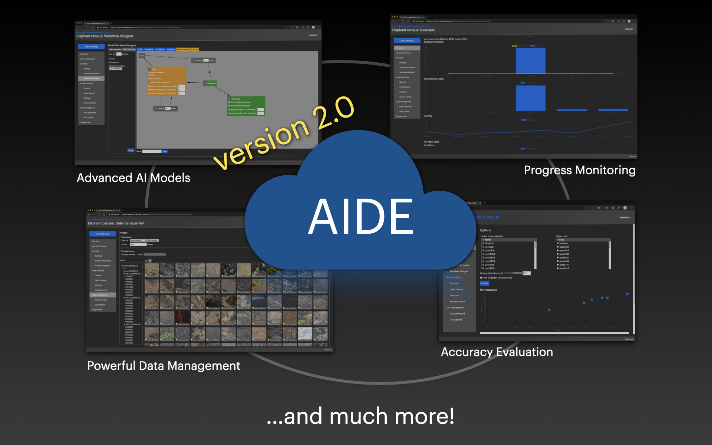

# News

## August 4, 2021
AIDE v2.1 is out! This includes a new interactive installer for Debian/Ubuntu systems as well as a plethora of bug fixes.

## May 25, 2021

We are delighted to officially announce AIDE version 2!
Highlights:
* Multi-project support: create and configure as many annotation projects as you like through the Web browser, all on one installation of AIDE.
* Powerful new models: AIDE v2 officially includes [Detectron2](https://github.com/facebookresearch/detectron2) and comes with a plethora of powerful, deep learning-based models, from ResNet over Faster R-CNN to DeepLabV3+ (see [below](#built-in-ai-models)).
* Model Marketplace: choose from a variety of pre-trained deep learning models to start with good quality predictions from the first few labels. Contribute and share your own models with other people or across projects.
* Expansive quality control: monitor the progress and accuracy of users and models with a few clicks through the browser.

There's lots more to discover. Check out the [demo](#demo) or [get started](#installation-and-launching-aide) straightaway!

## November 19, 2020
We now have an official publication on AIDE:
Kellenberger, Benjamin, Devis Tuia, and Dan Morris. "AIDE: Accelerating image‐based ecological surveys with interactive machine learning." Methods in Ecology and Evolution 11(12), 1716-1727.
DOI: [10.1111/2041-210X.13489](https://doi.org/10.1111/2041-210X.13489).
Please cite this manuscript whenever you use AIDE in your work. Thank you very much!

## August 17, 2020
AIDE v2 now officially replaces the old version as the new master! If you have a v1 project running, you may want to migrate it according to the instructions [below](https://github.com/microsoft/aerial_wildlife_detection#migration-from-aide-v1). For the legacy v1 code, see [here](https://github.com/microsoft/aerial_wildlife_detection/tree/v1).

## July 17, 2020
AIDE now supports watching image folders for changes! Every project can be configured to automatically register newly added images and, optionally, remove all data for deleted images. See "Project Settings" > "General" and the new entry `watch_folder_interval` in the settings.ini file.

## June 11, 2020
The built-in RetinaNet now adapts to the project's label classes by adding or removing neurons whenever classes change! Check out the new, GUI-enhanced options in the project configuration page under "AI model" &gt; "Settings".

## June 10, 2020
Thanks to the outstanding work of contributor [Jarek](https://github.com/szjarek), AIDE V2 finally supports one-line installation and setup through [Docker](https://www.docker.com)! See [below](https://github.com/microsoft/aerial_wildlife_detection#with-docker) for instructions.