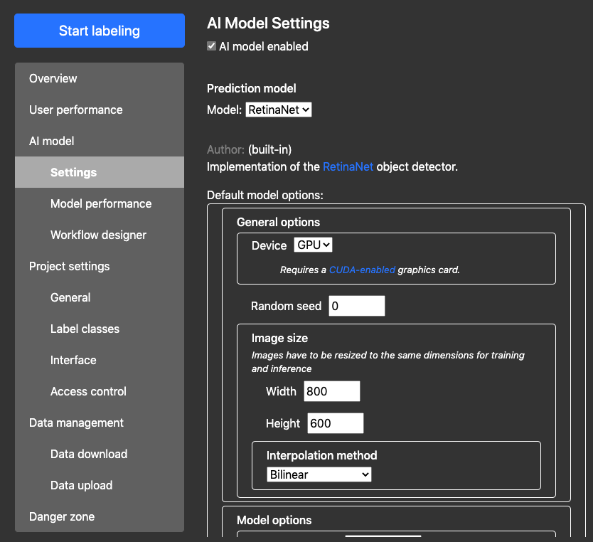
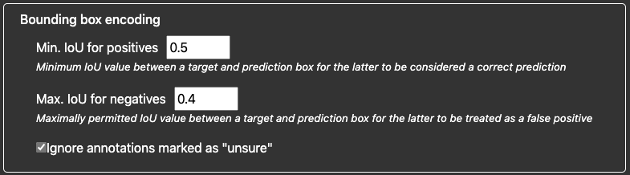

# Pretty-printed model options

By default, the model's settings (`options` parameter) can take any form you'd like, as long as they are in plain text. In the web interface (Project configuration > AI model > Settings), these then appear as plain text accordingly:


However, AIDE provides mechanisms to pretty-print model options as in the example image shown below:




The following instructions explain how to do that.


# Basic definition

To use AIDE's options engine, your model settings have to be in JSON-format as follows:
```json
{
    "defs": {
        ...
    },
    "options": {
        ...
    }
}
```
* `defs` contains option entry definitions that are used multiple times (see below).
* `options` contains the actual option entry definitions that are used.


## Entry types

### Base entry

A basic entry in the options engine consists of the following block (example):
```json
    "key" : {
        "name": "Optional name of the entry",
        "description": "Optional description of it."
    }
```

Notes:
* `key` is the identifier of the option entry. In principle, this does not have to be unique across __all__ options, but only across all others __within the same level__.
The following keywords are reserved and must not be used for keys: `id`, `name`, `description`, `value`, `type`, `min`, `max`, `style`, `options`.
* `name` is optional and will be replaced with `key` if not provided.
* `description` may contain HTML elements like links. `<script>` tags will be removed for safety reasons.

Every entry type explained below is effectively a subclass of this base entry configuration and can therefore receive both a name and a description accordingly.


### Boolean entry

Allows setting a parameter to true/false:

```json
    "bool_entry_key" : {
        "value": true
    }
```
The value under `value` is the default.


### Number entry

Allows setting a number (integer or floating point):
```json
    "number_entry_key" : {
        "value": 0.5,
        "type": "int",
        "min": 0,
        "max": 1,
        "style": {
            "slider": true
        }
    }
```
* `value` contains the default value.
* `type` is optional and specifies the number type (defaults to `float`).
* `min`, `max` are optional and limit the valid value range.
* Under `style`, you can specify a boolean for `slider`, if you wish this number to be adjustable by a slider/range.


### Select entry

Allows selecting options from a drop-down menu:
```json
    "selection_entry_key" : {
        "type": "select",
        "options": {
            "option_1_key": {
                "name": "Option 1"
            },
            "option_2_key": {
                "name": "Option 2"
            }
        },
        "value": "option_1_key"
    }
```
* `type` here defines that only one of the entries in `options` can be selected.
* `options` contains all entries that can be selectable from the drop-down menu. They can be of __any__ format. If they only contain a name (as shown), only the drop-down selector will be shown. If they themselves contain children settings (e.g., number input fields, child entries, etc.), these will be shown in a field below the selector.
* `value` is optional and denotes the default option to show (if found). Just add the key of the default option here. Otherwise, the first entry found will be shown by default.


### List entry

Similar to select entry, but the list entry allows adding __multiple__ options in a row:
```json
    "list_entry_key": {
        "type": "list",
        "options": {
"           option_1_key": {
                "name": "Option 1"
            },
            "option_2_key": {
                "name": "Option 2"
            }
        },
        "value": [
            "option_1_key",
            "option_1_key",
            "option_2_key"
        ]
    }
```
* `type` here defines that multiple of the entries in `options` can be selected.
* `value` is an array of defaults (optional). Can be left empty (for an empty list), or may contain keys of values under `options` that are to be shown as defaults in order.


## Adding children

AIDE allows nesting of arbitrary numbers of options within each other. For example, the following snippet:

```json
    "encoding": {
        "name": "Bounding box encoding",
        "minIoU_pos": {
            "name": "Min. IoU for positives",
            "description": "Minimum IoU value between a target and prediction box for the latter to be considered a correct prediction",
            "min": 0.0,
            "max": 1.0,
            "value": 0.5,
        },
        "maxIoU_neg": {
            "name": "Max. IoU for negatives",
            "description": "Maximally permitted IoU value between a target and prediction box for the latter to be treated as a false positive",
            "min": 0.0,
            "max": 1.0,
            "value": 0.4,
        },
        "ignore_unsure": {
            "name": "Ignore annotations marked as \"unsure\"",
            "value": true
        }
    }
```

Will be rendered as follows:


Essentially, the base option (`encoding`) contains three child options (`minIoU_pos`, `maxIoU_neg`, `ignore_unsure`) that are rendered within it as shown. To add children, simply add their definitions to the parent's definition.


## Globals

If you have option elements that you re-use a lot of times, you can define them once and simply refer to them wherever you use them:

```json

```


You can also use global definitions to substitute available values for select and list entries:

```json
{
    "defs": {
        "interpolations": {
            "image.nearest_neighbor": {
                "name": "Nearest neighbor interpolation"
            },
            "image.bilinear": {
                "name": "Bilinear interpolation"
            }
        }
    },
    "options": {
        "training": {
            "name": "Training options",
            "interpolation": {
                "name": "Interpolation type",
                "type": "select",
                "options": "interpolations"
            }
        }
    }
}
```

or, you can use them to define defaults (list entry example shown):
```json
{
    "defs": {
        "transform": {
            "randomHorizontalFlip": {
                "name": "Random horizontal flip"
            },
            "randomVerticalFlip": {
                "name": "Random vertical flip"
            }
        },
        "transform_train": [
            "randomHorizontalFlip",
            "randomVerticalFlip"
        ]
    },
    "options": {
        "training": {
            "transform_train": {
                "name": "Image transformations",
                "type": "list",
                "options": "transform",
                "value": "transform_train"
            }
        }
    }
}
```

Note the following:
* You can define as many children as you like, even under `defs`. Note that unlike the children in `options`, these **must** have unique identifiers (keys).
* You can refer to global definitions within global definitions (as done here: `transform_train` contains two definitions from global `defs` themselves).
* You can refer to global elements in `defs` directly by key, no matter how nested they are (as done here: the entries in `transform_train` are nested within global `defs`). This is one of the reasons why entries in `defs` must have unique keys.


## Parsing entries and retrieving values

Once your definition file is formatted correctly, your model needs to be able to:
1. Verify whether the file is correct (syntactically and value-wise);
2. Be able to extract values at the right position.

To this end, AIDE provides you with a number of helper functions that you can use when you receive model options (e.g., in the `__init__`, the `train`, `inference` calls, etc.):
```python
from util import optionsHelper

# read and parse your JSON-formatted options
options = optionsHelper.substitute_definitions(options)

# retrieve parameter value at a nested level
value = optionsHelper.get_hierarchical_value(options,
        keys=('options', 'general', 'device'),
        lookFor=('value', 'id'),
        fallback='cpu'
)
```

The first function (`substitute_definitions`) first retrieves all globals (key `defs` in the config file) and flattens them so that every entry can be accessed directly. Then, it substitutes the definitions under `options` with the globals where possible (i.e., where the keys match). Always run this function once before you start parsing the options (both default and user-provided).

The second function (`get_hierarchical_value`) traverses through the options and tries to find the value, or entry, under the given list of keys, one by one.
* `keys` is an iterable of option identifiers, ordered by traversal through the options tree from top to bottom. The example above applies to a configuration file that has an entry with key `general` at the top level (i.e., under `options`) and this entry itself has a child entry with key `device`.
* `lookFor` is a string or an iterable of strings containing specifiers that are to be searched for at every level if the next child key cannot be found.
For example, if the function is at `general`, it may not immediately find child `device` because it could be hidden under `value`, depending on the type of `general`. In this case, the function would first search for `device`, and if it fails (key does not exist), it would iterate through the keys under `lookFor` and try them one after another.
* `fallback` is a value that is returned if the entry cannot be found. Default is `None`.