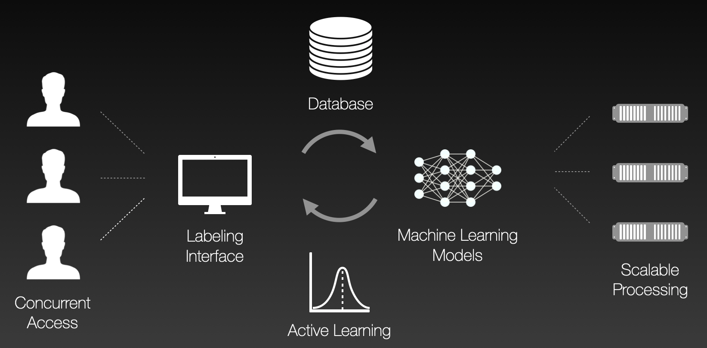

# AIDE: Annotation Interface for Data-driven Ecology


## AIDE v3.0

Exciting news: AIDE version 3.0 is on the way! This is the **nightly** build of it, thus with a plethora of bugs and (yet) unfinished code. Do not use for production environments.


### Status of planned features

(:red_circle: = development not started yet; :clock3: = work in progress; :ballot_box_with_check: = first version working, needs testing; :white_check_mark: = completed)

* :clock3: Support for new image formats:
  * :clock3: TIFF image parsing: :clock3: Web frontend works (needs testing with exotic TIFFs); :clock3: backend works but needs failsafety
  * :clock3: DICOM image parsing: :red_circle: Web frontend to be implemented (Daikon library); :clock3: backend prototype works (cannot save images; no metadata is kept)
* :clock3: Image rendering adjustments for Web frontend (percentile stretch does not yet work; grayscale images not yet supported)
* :clock3: Support for polygons (basic drawing and storing works, magnetic polygon works; GrabCut still glitchy)
* :clock3: New models for polygons: Detectron2 detectors (Faster R-CNN & Co.) work with polygons as input; dedicated models to be implemented
* :clock3: Advanced segmentation labeling tools: :ballot_box_with_check: paint bucket; :red_circle: rectangle, :ballot_box_with_check: polygon (might need improvements); :ballot_box_with_check: magnetic polygon; :red_circle: magic wand; :ballot_box_with_check: Grab Cut (needs polygon simplification algorithm)
* :red_circle: New design for annotation interface

More functionality might come and will be added to this list as implementations progress.


### Current issues

* Poor rendering performance for polygons with high vertex counts (need dropping intermediate adjustment handles if too short segments; multi-threaded proximity checks; etc.)


***


AIDE is two things in one: <i>a tool for manually annotating images</i> and <i>a tool for training and running machine (deep) learning models</i>. Those two things are coupled in an <i>active learning loop</i>: the human annotates a few images, the system trains a model, that model is used to make predictions and to select more images for the human to annotate, etc.
   
More generally, AIDE is a modular Web framework for labeling image datasets with AI assistance.  AIDE is configurable for a variety of tasks, but it is particularly intended for ecological applications, such as the acceleration wildlife surveys that use aerial images. 

AIDE is primarily developed by [Benjamin Kellenberger](https://bkellenb.github.io), supported by the [Microsoft AI for Earth](https://www.microsoft.com/en-us/ai/ai-for-earth) program.


## Contents
* [Highlights](#highlights)
* [News](#news)
* [Demo](#demo)
* [Installation and launching AIDE](#installation-and-launching-aide)
* [AI models in AIDE](#ai-models-in-aide)
  * [Built-in AI models](#built-in-ai-models)
  * [Writing your own AI model](#writing-your-own-ai-model)
* [Publications and References](#publications-and-references)
* [Contributing](#contributing)


## Highlights

* **Powerful:** AIDE explicitly integrates humans and AI models in an annotation loop.
* **Fast:** AIDE has been designed with speed in mind, both in terms of computations and workflow.
* **Flexible:** The framework allows full customizability, from hyperparameters to models to annotation types to libraries. It provides:
    * Support for image classification, point annotations, and bounding boxes (object detection)
    * Many deep learning-based AI models and Active Learning criteria built-in
    * Interfaces for custom AI models and criteria, using any framework or library you want (see how to [write your own model](doc/custom_model.md)).
* **Fully featured:** Beyond image labeling and model training, AIDE has management and graphical user/machine performance evaluation tools built-in, right in the web browser, allowing for advanced, manual label quality checks.
* **Modular:** AIDE is separated into individual _modules_, each of which can be run on separate machines for scalability. It even supports on-the-fly addition of computational workers for computationally intensive model training!




## News

### AIDE v2.1 is out

AIDE v2.1 is out! This includes a new interactive installer for Debian/Ubuntu systems as well as a plethora of bug fixes.


[Older news](doc/news.md)


## Demo

A demo of AIDE v2 can be accessed **[here](http://aidedemo.westeurope.cloudapp.azure.com:8080/)**.

This demo allows exploring the annotation front-end with a number of example datasets, including:
* **[Image labels](http://aidedemo.westeurope.cloudapp.azure.com:8080/snapshot_serengeti/interface)** on the [Snapshot Serengeti camera traps dataset](http://lila.science/datasets/snapshot-serengeti)
* **[Points](http://aidedemo.westeurope.cloudapp.azure.com:8080/vgg_penguins/interface)** on the [VGG Penguins dataset](http://www.robots.ox.ac.uk/~vgg/data/penguins/)
* **[Bounding boxes](http://aidedemo.westeurope.cloudapp.azure.com:8080/arcticseals/interface)** on the [NOAA Arctic Seals aerial imagery](http://lila.science/datasets/arcticseals)
* **[Semantic segmentation](http://aidedemo.westeurope.cloudapp.azure.com:8080/landcover/interface)** on the [Chesapeake Land Cover satellite imagery](http://lila.science/datasets/chesapeakelandcover)


## Installation and launching AIDE

See [here](doc/install_overview.md).


## AI models in AIDE

### Built-in AI models


AIDE ships with a set of built-in models that can be configured and customized:

| Label type | AI model | Model variants / backbones | More info |
|-|-|-|-|
| Image labels | AlexNet | AlexNet | [paper](https://arxiv.org/abs/1404.5997) |
|  | DenseNet | DenseNet-161 | [paper](https://arxiv.org/abs/1608.06993) |
|  | MNASNet | MNASNet | [paper](https://arxiv.org/abs/1807.11626) |
|  | MobileNet | MobileNet V2 | [paper](https://arxiv.org/abs/1801.04381) |
|  | ResNet | ResNet-18; ResNet-34; ResNet-50; ResNet-101; ResNet-152 | [paper](https://arxiv.org/abs/1512.03385) |
|  | ResNeXt | ResNeXt-50; ResNeXt-101 | [paper](https://arxiv.org/abs/1611.05431) |
|  | ShuffleNet | ShuffleNet V2 | [paper](https://arxiv.org/abs/1807.11164) |
|  | SqueezeNet | SqueezeNet | [paper](https://arxiv.org/abs/1602.07360) |
|  | VGG | VGG-16 | [paper](https://arxiv.org/abs/1409.1556) |
|  | Wide ResNet | Wide ResNet-50; Wide ResNet-101 | [info](https://pytorch.org/vision/stable/models.html#wide-resnet) |
| Bounding boxes | Faster R-CNN | with ResNet-50 (PASCAL VOC); with ResNet-50 (MS-COCO); with ResNeXt-101 FPN (MS-COCO) | [paper](https://arxiv.org/pdf/1506.01497.pdf), [implementation details](https://github.com/facebookresearch/detectron2/blob/master/MODEL_ZOO.md#faster-r-cnn) |
|  | RetinaNet | with ResNet-50 FPN (MS-COCO); with ResNet-101 FPN (MS-COCO) | [paper](https://openaccess.thecvf.com/content_ICCV_2017/papers/Lin_Focal_Loss_for_ICCV_2017_paper.pdf), [implementation details](https://github.com/facebookresearch/detectron2/blob/master/MODEL_ZOO.md#retinanet) |
|  | TridentNet | with ResNet-50; ResNet-101 (MS-COCO) | [paper](https://arxiv.org/abs/1901.01892), [implementation details](https://github.com/facebookresearch/detectron2/tree/master/projects/TridentNet)
| Segmentation masks | DeepLabV3+ | with modified ResNet-101 (Cityscapes) | [paper](http://openaccess.thecvf.com/content_ECCV_2018/papers/Liang-Chieh_Chen_Encoder-Decoder_with_Atrous_ECCV_2018_paper.pdf), [implementation details](https://github.com/facebookresearch/detectron2/tree/master/projects/DeepLab) |


All models can be configured in various ways through the AI model settings page in the Web browser. They all are pre-trained on [ImageNet](https://ieeexplore.ieee.org/document/5206848) unless specified otherwise.
To use one of the built-in models, simply import the requested one to your project through the Model Marketplace in the Web browser and start training/predicting!


### Writing your own AI model
AIDE is fully modular and supports custom AI models, as long as they provide a Python interface and can handle at least one of the different annotation and prediction types appropriately.
We greatly welcome contributions and are happy to help in the implementation of your custom models!

See [here](doc/custom_model.md) for instructions on implementing custom models into AIDE.


## Publications and References

Please cite the following paper if you use AIDE in your work:

Kellenberger, Benjamin, Devis Tuia, and Dan Morris. "AIDE: Accelerating image‐based ecological surveys with interactive machine learning." Methods in Ecology and Evolution 11(12), 1716-1727.
DOI: [10.1111/2041-210X.13489](https://doi.org/10.1111/2041-210X.13489).

```BibTeX
@article{kellenberger2020aide,
  title={AIDE: Accelerating image-based ecological surveys with interactive machine learning},
  author={Kellenberger, Benjamin and Tuia, Devis and Morris, Dan},
  journal={Methods in Ecology and Evolution},
  volume={11},
  number={12},
  pages={1716--1727},
  year={2020},
  publisher={Wiley Online Library}
}
```


If you use AIDE, we would be happy to hear from you! Please send us an [E-mail](mailto:benjamin.kellenberger@epfl.ch) with a little bit of info about your use case; besides getting to know the fellow usership of our software, this also enables us to provide somewhat more tailored support for you if needed. 
Thank you very much.


## Contributing

This project welcomes contributions and suggestions.  Most contributions require you to agree to a
Contributor License Agreement (CLA) declaring that you have the right to, and actually do, grant us
the rights to use your contribution. For details, visit https://cla.opensource.microsoft.com.

When you submit a pull request, a CLA bot will automatically determine whether you need to provide
a CLA and decorate the PR appropriately (e.g., status check, comment). Simply follow the instructions
provided by the bot. You will only need to do this once across all repos using our CLA.

This project has adopted the [Microsoft Open Source Code of Conduct](https://opensource.microsoft.com/codeofconduct/).
For more information see the [Code of Conduct FAQ](https://opensource.microsoft.com/codeofconduct/faq/) or
contact [opencode@microsoft.com](mailto:opencode@microsoft.com) with any additional questions or comments.
