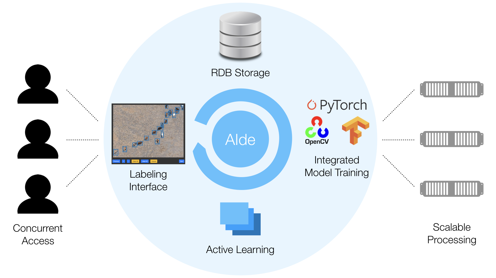

# AIDE: Annotation Interface for Data-driven Ecology

AIDE is two things in one: <i>a tool for manually annotating images</i> and <i>a tool for training and running machine (deep) learning models</i>. Those two things are coupled in an <i>active learning loop</i>: the human annotates a few images, the system trains a model, that model is used to make predictions and to select more images for the human to annotate, etc.
   
More generally, AIDE is a modular Web framework for labeling image datasets with AI assistance.  AIDE is configurable for a variety of tasks, but it is particularly intended for ecological applications, such as the acceleration wildlife surveys that use aerial images. 

AIDE is primarily developed by [Benjamin Kellenberger](https://bkellenb.github.io), supported by the [Microsoft AI for Earth](https://www.microsoft.com/en-us/ai/ai-for-earth) program.


## Highlights

* **Powerful:** AIDE explicitly integrates humans and AI models in an annotation loop.
* **Fast:** AIDE has been designed with speed in mind, both in terms of computations and workflow.
* **Flexible:** The framework allows full customizability, from hyperparameters to models to annotation types to libraries. It provides:
    * Support for image classification, point annotations, and bounding boxes (object detection)
    * A number of AI models and Active Learning criteria [built-in](doc/builtin_models.md)
    * Interfaces for custom AI models and criteria, using any framework or library you want (see how to [write your own model](doc/custom_model.md)).
* **Fully featured:** Beyond image labeling and model training, AIDE has management and graphical user/machine performance evaluation tools built-in, right in the web browser, allowing for advanced, manual label quality checks.
* **Modular:** AIDE is separated into individual _modules_, each of which can be run on separate machines for scalability. It even supports on-the-fly addition of computational workers for computationally intensive model training!




## News

* **August 17, 2020:** AIDE v2 now officially replaces the old version as the new master! If you have a v1 project running, you may want to migrate it according to the instructions [below](https://github.com/microsoft/aerial_wildlife_detection#migration-from-aide-v1). For the legacy v1 code, see [here](https://github.com/microsoft/aerial_wildlife_detection/tree/v1).
* **July 17, 2020:** AIDE now supports watching image folders for changes! Every project can be configured to automatically register newly added images and, optionally, remove all data for deleted images. See "Project Settings" > "General" and the new entry `watch_folder_interval` in the settings.ini file.
* **June 11, 2020:** The built-in RetinaNet now adapts to the project's label classes by adding or removing neurons whenever classes change! Check out the new, GUI-enhanced options in the project configuration page under "AI model" &gt; "Settings".
* **June 10, 2020:** Thanks to the outstanding work of contributor [Jarek](https://github.com/szjarek), AIDE V2 finally supports one-line installation and setup through [Docker](https://www.docker.com)! See [below](https://github.com/microsoft/aerial_wildlife_detection/tree/multiProject#with-docker) for instructions.


## Demos

You can try out the labeling frontend of AIDE (V1) in a couple of demo instances:

* **[Image labels](http://aerialannotationdemo.southcentralus.cloudapp.azure.com/snapshot-serengeti/interface)** on the [Snapshot Serengeti camera traps dataset](http://lila.science/datasets/snapshot-serengeti)
* **[Points](http://aerialannotationdemo.southcentralus.cloudapp.azure.com/vgg-penguins/interface)** on the [VGG Penguins dataset](http://www.robots.ox.ac.uk/~vgg/data/penguins/)
* **[Bounding boxes](http://aerialannotationdemo.southcentralus.cloudapp.azure.com/arcticseals/interface)** on the [NOAA Arctic Seals aerial imagery](http://lila.science/datasets/arcticseals)
* **[Semantic segmentation](http://aerialannotationdemo.southcentralus.cloudapp.azure.com/landcover/interface)** on the [Chesapeake Land Cover satellite imagery](http://lila.science/datasets/chesapeakelandcover) _(early preview - stay tuned for official announcement of segmentation support!)_


## Framework Overview

AIDE consists of individual _modules_, organized as follows:


* **LabelUI**: responsible for delivering and accepting predictions and annotations to and from the user/labeler
* **AIWorker**: runs the AI model in the background to train and predict data
* **AIController**: distributes and manages jobs to and from the individual _AIWorker_ instance(s)
* **Database**: stores all metadata (image paths, viewcounts, user annotations, model predictions, user account data, etc.)
* **FileServer**: provides image files to both the _LabelUI_ and _AIWorker_ instances
* **Message Broker**: AIDE makes use of [Celery](http://www.celeryproject.org/), a distributed task queue leveraging message brokers like [RabbitMQ](https://www.rabbitmq.com/) or [Redis](https://redis.io/).


The framework can be configured in two ways:
1. As a static labeling tool (_i.e._, using only the modules in (a)). In this case there will be no AI assistance for labeling or prioritizing the relevant images.
2. As a full suite with AI support, using all modules.

The individual modules need not be run on separate instances; it is possible to combine the components in any way and launch multiple (or all) modules on one machine. For example, the diagram above shows three _AIWorker_ instances, but the number of workers can be chosen arbitrarily, and workers may be added or removed on-the-fly.


## Using a built-in AI model
AIDE ships with a set of built-in models that can be configured and customized for a number of tasks (image classification, object detection, etc.).  See [this page](doc/builtin_models.md) for instructions on how to use one of the built-in models.


## Writing your own AI model
AIDE is fully modular and supports custom AI models, as long as they provide a Python interface and can handle the different annotation and prediction types appropriately. See [here](doc/custom_model.md) for instructions on using custom models.


## Installation and launching AIDE

### Migration from AIDE v1
If you have [AIDE v1](https://github.com/microsoft/aerial_wildlife_detection/tree/v1) already running and want to upgrade its contents to AIDE v2, see [here](doc/upgrade_from_v1.md).


### New installation

#### With Docker

AIDE now comes with both [Docker](https://www.docker.com) and [Docker Compose](https://docs.docker.com/compose) support!
The current scripts are not 100% tested yet, but they make installation a breeze!

Here's how to install and launch AIDE with Docker on the current machine:

1. Download and install [Docker](https://www.docker.com/get-started) as well as [Docker Compose](https://docs.docker.com/compose)
2. If you want to use a GPU (and only then), you have to install the NVIDIA container toolkit:
```bash
    distribution=$(. /etc/os-release;echo $ID$VERSION_ID)
    curl -s -L https://nvidia.github.io/nvidia-docker/gpgkey | sudo apt-key add -
    curl -s -L https://nvidia.github.io/nvidia-docker/$distribution/nvidia-docker.list | sudo tee /etc/apt/sources.list.d/nvidia-docker.list
    sudo apt-get update && sudo apt-get install -y nvidia-container-toolkit
    sudo systemctl restart docker
```
3. Clone the AIDE repository: `git clone https://github.com/microsoft/aerial_wildlife_detection.git --branch multiProject && cd aerial_wildlife_detection/`
4. **Important:** modify the `docker/settings.ini` file and replace the default super user credentials (section `[Project]`) with new values. Make sure to review and update the other default settings as well, if needed.
5. Install:
    ```bash
        cd docker
        sudo docker-compose build
        cd ..
    ```
6. Launch:
    * With Docker:
    ```bash
        sudo docker/docker_run_cpu.sh     # for machines without a GPU
        sudo docker/docker_run_gpu.sh     # for AIWorker instances with a CUDA-enabled GPU (strongly recommended for model training)
    ```
    * With Docker Compose (note that Docker Compose currently does not provide support for GPUs):
    ```bash
        cd docker
        sudo docker-compose up
    ```


#### Manual installation

See [here](doc/install.md) for instructions on configuring an instance of AIDE.

After that, see [here](doc/launch_aide.md) for instructions on launching an instance of AIDE.


## Contributing

This project welcomes contributions and suggestions.  Most contributions require you to agree to a
Contributor License Agreement (CLA) declaring that you have the right to, and actually do, grant us
the rights to use your contribution. For details, visit https://cla.opensource.microsoft.com.

When you submit a pull request, a CLA bot will automatically determine whether you need to provide
a CLA and decorate the PR appropriately (e.g., status check, comment). Simply follow the instructions
provided by the bot. You will only need to do this once across all repos using our CLA.

This project has adopted the [Microsoft Open Source Code of Conduct](https://opensource.microsoft.com/codeofconduct/).
For more information see the [Code of Conduct FAQ](https://opensource.microsoft.com/codeofconduct/faq/) or
contact [opencode@microsoft.com](mailto:opencode@microsoft.com) with any additional questions or comments.
